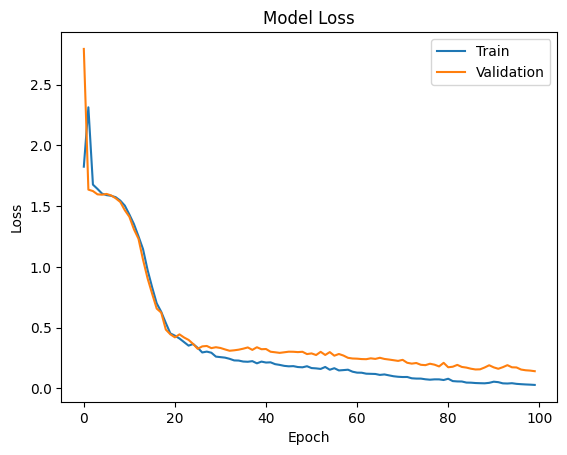
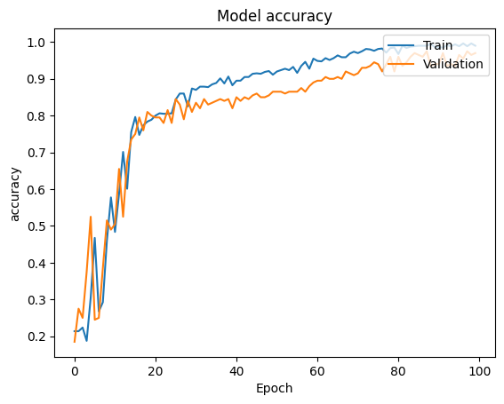
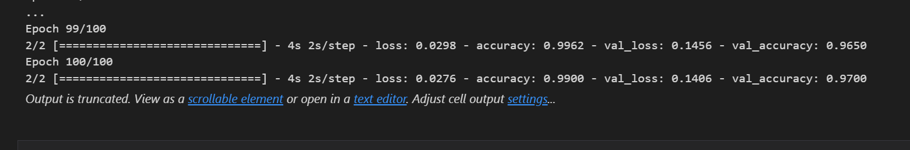
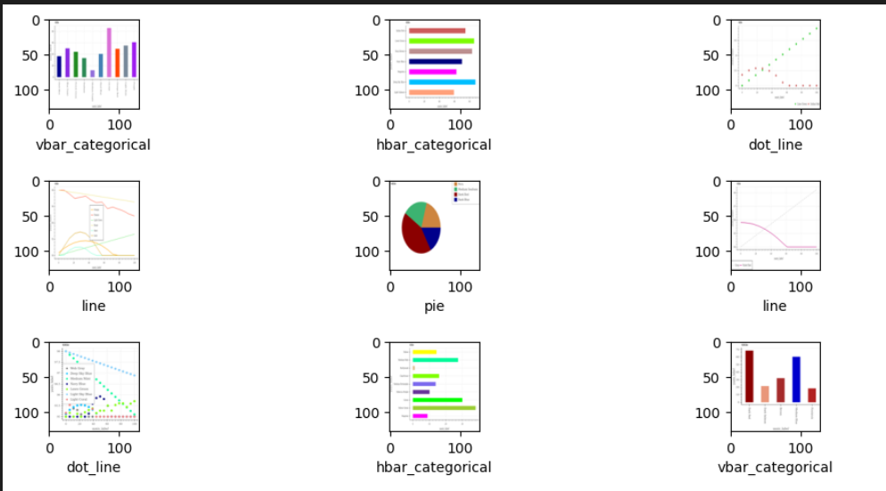

# CNN-based-classification-architecture-for-classifying-images

## Introduction
The aim of this project is to classify different types of charts using a convolutional neural network (CNN). The dataset consists of images of different charts such as line charts, bar charts, and scatter plots. The objective is to train a model that can classify the type of chart from the given image.

## Data Preprocessing
The dataset was provided in the form of PNG images. The images were converted to grayscale and then normalized to values between 0 and 1. The dataset consisted of 1000 images, out of which 800 images were used for training and 200 images were used for validation.

The dataset was loaded using Pandas data frames. Each record of the data frame contained the image data and the corresponding type of chart. The types of charts were mapped to integers to be used as class labels for the CNN model.

## Model Architecture
The CNN model consisted of three convolutional layers with ReLU activation functions followed by max-pooling layers. The convolutional layers were responsible for extracting features from the images. The output from the convolutional layers was then flattened and passed through two dense layers with ReLU activation functions. The final layer was a dense layer with a softmax activation function that produced the classification probabilities for the five classes of charts.

## Model Training
The model was compiled using the Adam optimizer and sparse categorical cross-entropy loss function. The model was trained for 100 epochs with a batch size of 500. An early stopping callback was used to stop the training if the validation loss did not improve after 10 consecutive epochs.

The training and validation loss and accuracy were recorded for each epoch. The plots of the training and validation loss and accuracy were used to visualize the training process and evaluate the performance of the model.

## Model Evaluation
The trained model was evaluated on the validation set, which was not used during the training process. The evaluation was done using the evaluate method of the Keras API, which calculated the loss and accuracy of the model on the validation set.

## Prediction
The trained model was used to predict the types of charts in the test set, which consisted of 50 images. The images were loaded using the PIL library, and the prediction was made using the predict method of the Keras API. The predicted class label was then mapped to the corresponding type of chart using the type_list variable.

## Conclusion
The CNN model achieved an accuracy of 97% on the validation set and correctly predicted the types of charts in the test set with a high accuracy. The model can be further improved by increasing the number of epochs, using a larger dataset, or using a more complex model architecture. 
The final model is saved for future use.

